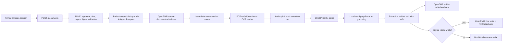
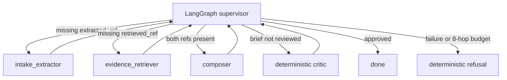
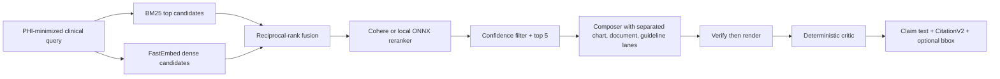
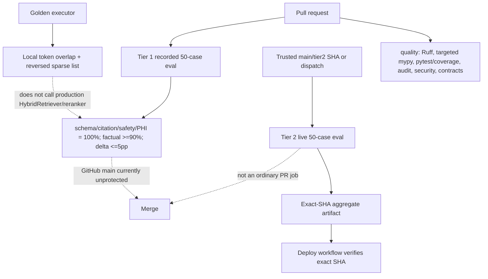
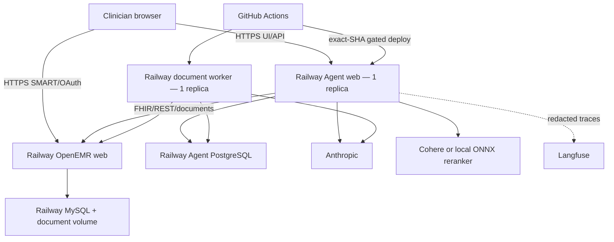

# AgentForge Clinical Co-Pilot — Week 2 Current-State Architecture

**Audit basis:** `docs/week2/Week_2_AgentForge.pdf`, pages 1–7

**Repository state inspected:** `658307936f0396d292c94fff3f9ef8089f1697e7`

**Deployment inspected:** 2026-07-18 (America/New_York); re-verified 2026-07-19 with cache-busted probes

**Readiness verdict:** **Not Ready** — see `docs/week2/W2_gap-audit.md`

This document describes what the repository and public deployment actually do. It supersedes
the earlier future-tense planning claims in this file. A configured component is not called
deployed unless it was observable at the public exact-SHA deployment.

## Status legend

- **Implemented and deployed** — implementation plus public exact-SHA runtime evidence.
- **Implemented but not deployment-verified** — implementation and tests exist; the live path was not exercised.
- **Partially implemented** — a required behavior or boundary is incomplete.
- **Planned** — design or runbook exists without complete implementation/evidence.
- **Missing** — no adequate artifact or behavior was found.
- **Unable to verify** — verification needs credentials, protected provider/account data, or unavailable infrastructure.

## 1. System context and actual stack

The product is a SMART-on-FHIR sidecar for an OpenEMR deployment. The inherited EHR is PHP/MySQL.
Project-specific agent code is Python 3.12 with FastAPI, Pydantic 2, httpx, Anthropic, LangGraph,
Langfuse, asyncpg, cryptography, pypdfium2, pdfplumber, pytesseract/Tesseract, fastembed/ONNX,
and BM25 (`agent/pyproject.toml:1-61`). Railway runs separate web and document-worker services
from one image (`agent/railway.json:1-12`, `agent/railway.worker.json:1-12`). Agent operational
state is in PostgreSQL; OpenEMR uses MySQL plus its document store.

External dependencies are OpenEMR REST/FHIR/OAuth, Anthropic, Agent PostgreSQL, and optionally
Cohere and Langfuse. The local ONNX reranker is the default documented fallback. Required names,
timeouts, limits, feature flags, document category IDs, delegated-credential encryption key,
and service URLs are inventoried in `agent/.env.example:4-59`; secret values are not committed.

| Capability | Status | Evidence and boundary |
|---|---|---|
| Public web process, health, and readiness | **Implemented and deployed** | Cache-busted 2026-07-19: `/health` returned SHA `658307…` (= repo HEAD); `/ready` returned `ready` with eight checks green, including `document_runtime: ready` and `document_category_read: authorized_read_ok`. Plain-URL probes can still serve a stale intermediary-cached pair (an older SHA and a `degraded`/reranker-timeout snapshot) — the staleness class fixed by `8a21edc`; graders should revalidate with a unique query string. The cached degraded snapshot is also positive evidence that non-binary readiness has served in production. |
| Public SMART launch entry | **Implemented and deployed** | Browser and cookie-aware redirect probe reached OpenEMR Authorization sign-in. Authentication was not completed. |
| Public guideline retrieval | **Implemented and deployed** | Anonymous bounded `/evidence/search` returned five version-pinned VA/DoD snippets with a correlation ID. |
| Authenticated upload → extract → OpenEMR write/readback | **Unable to verify** | No tester credentials were available; repository tests use fakes/stubs. |
| Supervisor/worker graph in the deployment | **Unable to verify** | `W2_GRAPH_ENABLED` defaults to `0` (`agent/.env.example:49-53`); deployed value is not exposed. |
| Per-claim final-response traceability | **Partially implemented** | Internal composition is per-claim, but JSON and the initial SSE/fallback block flatten a brief and citation list (`agent/app/routes/chat.py:124-139,218-251,362-371`). |
| Eval gate as an unbypassable merge gate | **Partially implemented** | Scorers and red drills work, but GitHub `main` has no protection/ruleset and Tier 2 is not an ordinary PR job. |

## 2. Week 1 baseline and Week 2 additions

Week 1 remains the patient-pinned, read-only brief path: SMART launch, delegated FHIR reads,
typed evidence, verify-then-flush composition, CitationV2, correlation IDs, and optional Langfuse.
Week 2 adds document upload, a durable worker, OCR/VLM extraction, local grounding, OpenEMR
document/artifact writes, eligible intake-vital writes, a guideline corpus, hybrid retrieval,
LangGraph routing, a critic, document preview/bounding boxes, and the 50-case eval suite.

Week 2 does **not** write lab Observations or MedicationRequests. Lab PDFs and medication lists
are stored as source documents plus extraction artifacts; eligible intake vitals may be written
to the selected encounter (`README.md:19-36`). Therefore the implemented lab-trend widget is
artifact-backed, not the PDF's disputed “extracted Observation data” interpretation.

## 3. Document ingestion, extraction, and persistence

### Current flow

**Implemented but not deployment-verified.** `lab_pdf` and `intake_form` use canonical
Pydantic models (`agent/app/schemas/extraction.py:77-214`). Lab results include name, value,
unit, reference range, collection date, abnormal flag, and citation; intake includes demographics,
chief concern, medications, allergies, family history, vitals, and citations. `NormBBox` is
normalized, page-relative geometry.

The pipeline accepts only the expected model, performs `model_validate(..., strict=True)`, checks
the source document ID, and locally rebuilds grounding (`agent/app/ingestion/pipeline.py:319-374`).
Raw provider JSON cannot become an artifact without that boundary. Upload admission and
patient/encounter checks fail closed before storage. The durable queue has transactional claims,
leases, heartbeats, bounded backoff, and stale-lease recovery. Write intents use
`pending|unknown|complete`, a patient-scoped permanent key, remote markers, and reconcile-before-
retry (`agent/migrations/003_document_jobs.sql:5-71`). Delegated job credentials are encrypted;
the dedicated worker has an independent heartbeat (`agent/migrations/005_job_credentials.sql:5-28`).

The closest equivalent to `attach_and_extract(patient_id, file_path, doc_type)` is the typed
document-operations/service boundary plus `ValidatedUpload`. The behavior exists, but a few
facade signatures still expose `object` or open strings, so the “every interface typed” claim is
only partial.

### Data authority and lineage

| Data type | Current owner/read path | Validation/access | Current assessment |
|---|---|---|---|
| Uploaded source bytes | OpenEMR document store; Agent Postgres keeps job/dedup metadata | Pinned session, patient match, MIME/digest/cap checks | Traceable in code/tests; live round trip **unable to verify**. |
| Extraction artifact | Copied to OpenEMR **and** persisted/read from Agent Postgres | Strict Pydantic + local grounding; patient-bound endpoints | **Partially implemented authority:** two durable copies and active reads from PostgreSQL. |
| Intake vital | OpenEMR record/FHIR Observation readback | Eligible grounded fields, owned encounter, permanent write intent | Implemented/tested; live write **unable to verify**. |
| Lab result | Grounded extraction artifact; no lab Observation write | Strict lab schema and CitationV2 | Honest non-write, but conflicts with the disputed Observation-backed trend deliverable. |
| Guideline chunk | Versioned committed corpus/index | Manifest hash, source/license metadata, PHI-free query screen | Repository is source of truth. |
| Citation | Artifact/Agent PostgreSQL reference and API projection | Closed CitationV2 plus source-specific location rules | Stored traceably; final HTTP claim association is incomplete. |

Silent overwrites are constrained by SQL uniqueness and collision checks
(`agent/migrations/003_document_jobs.sql:5-59`, `004_extraction_refs.sql:4-15`). The remaining
authority problem is not missing lineage; it is the unsupported claim that OpenEMR alone owns
derived artifacts while active report/trend hydration reads the PostgreSQL copy.

## 4. Supervisor and workers

**Partially implemented; deployment unable to verify.** A real `StateGraph` defines supervisor,
`intake_extractor`, `evidence_retriever`, composer, and critic nodes with an eight-hop bound
(`agent/app/orchestrator/graph.py:91-99,591-613`). Handoffs carry typed reference-only inputs and
outputs, a closed decision/reason code, correlation ID, turn, worker, and timestamp.

Two limitations matter:

1. Routing is state-sequential rather than need-sensitive: absent `extracted_ref` always routes
   extraction, then absent `retrieved_ref` always routes retrieval
   (`agent/app/orchestrator/graph.py:208-229`).
2. Trace export creates a supervisor span with flat worker-hop children, but OCR/VLM/schema/write
   and BM25/dense/rerank sub-calls are not child spans inside their worker span
   (`agent/app/orchestrator/graph.py:714-770`).

The feature flag defaults off. Until the deployed value and an authenticated trace are shown,
the required deployed multi-agent flow is **Unable to verify**.

## 5. Hybrid RAG, answer grounding, and citations

**Implemented and deployed for public retrieval; composed clinical flow not deployment-verified.**
The committed VA/DoD corpus records provenance, licenses, hashes, exclusions, six artifacts, and
653 chunks (`agent/corpus/manifest.json:1-45,262-265`). `HybridRetriever` runs BM25+dense search,
reciprocal-rank fusion, Cohere or local reranking, confidence filtering, safe no-result handling,
and a breaker/fallback path (`agent/corpus/retrieval.py:240-258,323-539,590-800`). Only the highest
ranked five snippets enter the answer context.

`CitationV2` is a closed five-field contract with `source_type`, `source_id`,
`page_or_section`, `field_or_chunk_id`, and `quote_or_value` (`agent/app/schemas/citations.py:26-97`).
Patient-record, uploaded-document, and guideline evidence remain separate. Uploaded-document
claims require a page and bounding box; the page endpoint renders a session/patient-bound preview.
The composer drops incomplete/uncited claims and the critic rejects uncited, unresolved,
mixed-source, diagnosis, treatment, ordering, or prescribing claims.

**Hard gap:** `ChatResponse` returns one multi-claim `brief` and one flat citation list; the
initial SSE block does the same. Week 2 composition SSE events preserve one claim/one citation,
but the normal JSON and fallback UI do not. Thus every citation is machine-readable, but every
final clinical claim is not machine-linked to its own citation.

## 6. APIs, contracts, and UI

The committed OpenAPI 3.0.3 document covers health/readiness, SMART launch, documents, status,
artifact/readback, extraction reports, preview, evidence search, and chat
(`agent/ops/openapi.yaml:1-399`). Contract tests compare mounted/generated operations, schemas,
enums, media types, and the Bruno collection. Bruno covers lab/intake upload, duplicate upload,
status, readback, report, page preview, retrieval, chat, health, and readiness.

Canonical strict contracts exist for extraction, CitationV2, answer context, handoffs, jobs,
write intents, and most route payloads. Weak `object`/open-string surfaces remain in service and
writeback facades. The old architecture's reference to a nonexistent
`agent/migrations/002_oauth_state.sql` was incorrect; durable job credentials are migration 005.

The UI has document upload/status, extraction report, click-to-source citations, on-demand page
preview, bounding-box overlays, lab trends, and safe missing-data/refusal rendering. These paths
are tested locally but were not authenticated in the public deployment.

## 7. Observability, privacy, and reliability

**Partially implemented; operational W2 export unable to verify.** Correlation middleware covers
HTTP boundaries. Pydantic event envelopes define ingestion, grounding, retrieval, handoff, queue,
breaker, eval, and terminal encounter-summary fields (`agent/app/observability/events.py:193-345`).
Structured logging uses closed reason codes and avoids exception messages and clinical content.
Trace metadata hashes identifiers and Langfuse masks content.

The composition root defaults the Week 2 event emitter to `NullEventSink`
(`agent/app/service.py:202-205`). Several registered Week 2 events have no normal-path emit site —
verified for `RETRIEVAL_COMPLETED`/`RetrievalAttributes` (`agent/app/observability/events.py:246-250`),
which is defined and registered but never emitted anywhere; retrieval telemetry flows through
structured logs and the encounter summary instead (`agent/corpus/retrieval.py:790-799`). The two
encounter-summary emitters also each zero-fill the other's half (ingestion hardcodes
`retrieval_hit_count: 0`, `agent/app/ingestion/telemetry.py:207`; the orchestrator sink hardcodes
retrieval/grounding fields, `agent/app/observability/langfuse.py:486-487`), so no single event
fuses retrieval hits, extraction confidence, and routing for one clinical turn.

Dashboard and alert JSON exist and are schema-tested, but no active import/wiring was found —
specifically, `agent/ops/alert_checker.py` evaluates a four-signal Week-1 set
(`evaluate()`, `alert_checker.py:481-515`: p95 latency, request error rate, tool failure rate,
LLM fallback rate), never reads `agent/ops/w2_alerts.json`, and is not invoked by any workflow,
cron, or Railway config. The >5pp eval-regression rule is enforced at the CI gate
(`agent/evals/artifact_scan.py:562-573`), not by a runtime alerter. Current runbooks are usable,
while operational dashboards, alert destinations, and correlation-only reconstruction are not
proven. Langfuse being green in `/ready` proves reachability, not event completeness.

The repository is explicitly synthetic/demo-only. CI scans generated logs, traces, reports,
results, recordings, screenshots, and known-leak fixtures. No confirmed real PHI was found.
Prompts, source pages, extracted values, screenshots, job state, credentials, and trace metadata
remain sensitive even when the demo data is synthetic. SaaS observability receives redacted,
aggregate metadata only; using real PHI would require separately verified BAA, region, tenant,
retention, and access controls.

`/health` is liveness plus deployed SHA. `/ready` runs bounded cached hard/soft probes and can
return `ready`, `degraded`, or `not_ready` (`agent/app/health.py:195-296`). The live report checked
OpenEMR FHIR, Anthropic, session store, Langfuse, retrieval index, active reranker, document
runtime/worker heartbeat, and authorized document-category read. Readiness does not prove the
complete OAuth/login transaction or the authenticated Week 2 flow.

### Failure detection and recovery

| Failure | Detection | Recovery behavior | Status |
|---|---|---|---|
| Upload/admission failure | Closed request reason and correlation ID | Reject before queue/write | **Implemented but not deployment-verified** |
| OCR/VLM/schema failure | Job stage/reason, grounding counts | Bounded retry; unsupported/failed state; never persist raw proposal | **Implemented but not deployment-verified** |
| Ambiguous OpenEMR write | `unknown` write intent | Reconcile remote marker before retry; never blind-write | **Implemented but not deployment-verified** |
| Empty/low-confidence RAG | Empty evidence outcome | No-evidence response/refusal | **Implemented and deployed** |
| Reranker outage | timeout/breaker/fallback telemetry | Local fallback or degraded result | **Implemented but not deployment-verified** |
| Supervisor error/budget | handoff reason/8-hop bound | retry bound then deterministic refusal | **Implemented but not deployment-verified** |
| Worker loss | lease expiry and worker heartbeat readiness | stale lease recovery and bounded backoff | **Implemented but not deployment-verified** |
| Event/trace exporter loss | dropped counter/soft readiness | serving continues | **Partially implemented** |

## 8. Evaluation and CI

Exactly 50 PDF fixtures and cases are committed. Required boolean rubrics and thresholds are
implemented: schema, citation, safe refusal, and no-PHI are 100% invariants; factual consistency
is at least 90% and may not regress by more than five percentage points
(`agent/evals/harness.py:26-100`). Tier 1 is network-disabled. Exact-SHA GitHub runs were green,
   including a protected-environment live Tier 2 artifact; recorded red drills prove each scorer can turn a job
red. Local verification on this audit ran 936 tests (5 skipped) and the 50-case recorded eval,
all green.

Independent 2026-07-19 corroboration: the five red-drill SHAs documented in
`docs/week2/evidence/W2_CI_EVIDENCE.md` match the local `drill/w2-red-{schema,citation,factual,
short-phi,unsafe-side-effect}` branch tips exactly, and a sandboxed re-execution of the committed
gate arithmetic (`evals/harness.aggregate_scores` from an isolated copy) reproduced
control-pass / regression-fail (−8.695652pp → `failed >5 percentage-point baseline regression`) /
boundary-allowed (−5.00pp exactly) / 100%-invariant-fail / absolute-threshold-fail behavior. One
scope nuance: the recorded Tier-1 gate passes `baseline=None` (`agent/evals/w2_runner.py:341-347`),
so the >5pp delta rule is enforced only in the live tier — on a pull request, a factual regression
is caught only by the absolute ≥0.90 floor.

Two failures prevent calling this a hard gate:

1. The golden executor's `_local_retrieve` token-overlap ranking reverses its sparse IDs to mimic
   a dense list and never instantiates the production `HybridRetriever` or selected reranker
   (`agent/evals/execution.py:843-907`). A production hybrid-retrieval regression can stay green.
2. GitHub API inspection found `main` unprotected and no repository rulesets. Tier 2 runs only
   on trusted dispatch/push conditions, not ordinary pull requests
   (`.github/workflows/agent-eval-gate.yml:77-151`). Hooks are optional. The workflow can fail,
   but it is not proven capable of blocking merge.

The committed `results-tier1.json` is PASS but says `local-uncommitted`; committed
`results-tier2.json` is INCONCLUSIVE with zero calls (`agent/evals/results-tier2.json:1-27`). The
current exact-SHA green Tier 2 result exists only as a GitHub artifact, so repository evidence is
stale even though CI evidence is green.

## 9. Testing strategy and guarded failures

| Layer | What runs | Failure guarded against | Limits |
|---|---|---|---|
| Unit/contract | Pydantic validators, query screen, scorer math, critic/composer, auth/pin checks, OpenAPI/Bruno | malformed schema, ungrounded fields, unsafe claim, contract drift, cross-patient access | External services are faked. |
| Integration | upload → durable job → extraction/grounding → write intent/readback; graph and retrieval suites | lost jobs, duplicate writes, bad handoffs, no-result and breaker behavior | Live OpenEMR/model/reranker paths are mostly stubbed. |
| Golden Tier 1 | 50 recorded cases, five rubrics, output scan | extraction/citation/refusal/missing-data/PHI regressions | Retrieval is the pseudo path described above. |
| Golden Tier 2 | bounded live Anthropic execution and exact-SHA artifact | provider/prompt/judge behavior drift | Not an ordinary PR job; committed result is stale. |
| Deployment smoke | health, readiness, public app, SMART sign-in, evidence search | dead service, dependency/index/reranker failure, obvious launch failure | No authenticated upload/chat/preview or graph trace in this audit. |

Not tested/proven: production-equivalent retrieval inside the required golden gate; current
authenticated end-to-end Week 2 flow; deployed graph enablement; nested worker sub-spans;
operational W2 event sink/dashboard/alerts; production resource profile; automatic backup and
restore; real-PHI SaaS controls. These are gaps, not assumed passes.

## 10. Deployment topology

The checked-out SHA matched `/health`, the current GitHub main/deploy/eval runs, and the public
service. No code-versus-deployment SHA drift was found; a cache-busted 2026-07-19 re-probe
confirmed `/health` serves the exact HEAD SHA and `/ready` serves `ready` with all eight checks
green (plain URLs may return stale intermediary-cached responses — see §1). Public `/app`,
`/health`, `/ready`, `/openapi.json`, SMART sign-in, and `/evidence/search` were reachable.
Deployment-specific clinical behavior remains **Unable to verify** because no authenticated
synthetic tester session was available. A cookie-less redirect client reaches an OpenEMR error
because it discards the OAuth server cookie; browser and cookie-aware probes reach sign-in, so
that observation is not classified as an outage. The GitLab submission mirror
(`labs.gauntletai.com/alexander.miller/openemr-base-clean`, configured as the `gitlab` remote
with a committed `.gitlab-ci.yml`) was unreachable through this audit environment's proxy, so
mirror sync and enforcement state are **Unable to verify** from here.

## 11. Performance, cost, backup, and recovery

**Partially implemented.** Working acceptance ceilings are retrieval p95 ≤2s
and ingestion p95 ≤30s, but no qualifying post-closeout four-flow deployment profile is committed
(`docs/week2/evidence/W2_BASELINES.md:31-44`). The current exact-SHA live eval artifact measured
50 calls, about $3.07, p50 5.61s, and p95 12.27s for the eval aggregate, but this is not the
required ingestion/extraction/retrieval/full-graph CPU, memory, throughput, per-leg latency,
Week 1 comparison, development spend, or production forecast. The cost report explicitly leaves
protected billing/resource totals to an owner
(`docs/week2/evidence/W2_COST_LATENCY.md:17-40`).

The repository contains a restore-drill adapter and targets RPO ≤24h/RTO ≤60m, including OpenEMR
MySQL/document volume, Agent PostgreSQL, migrations, credentials, readback, and dedup. Production
backups and an isolated restore target were unavailable; no executed restore is claimed
(`docs/week2/evidence/W2_BACKUP_RESTORE.md:1-25`). The golden fixtures, manifest, scorer, judge configuration, and
recordings are repository-reproducible.

## 12. Risks, limitations, and current submission gaps

| Priority | Gap or tradeoff | Consequence |
|---|---|---|
| P0 | Main has no required-check enforcement; live Tier 2 is not an ordinary PR check | A red workflow or skipped workflow does not reliably prevent merge. |
| P0 | Required golden gate does not execute production hybrid retrieval/reranking | A core RAG regression can pass the hard gate. |
| P0 | Normal JSON/fallback final responses flatten claim-to-citation association | Per-claim machine traceability is not guaranteed. |
| P1 | Authenticated deployment and graph flag are unverified | The required deployed core flow is not submission-proven. |
| P1 | Sequential supervisor routing and flat worker tracing | Need decisions and nested sub-call provenance are incomplete. |
| P1 | OpenEMR/PostgreSQL derived-artifact dual authority | “One source of truth” is not enforced. |
| P1 | W2 event sink defaults null; dashboards/alerts are configured only | Correlation-only incident reconstruction and required operational panels are unproven. |
| P1 | Video, complete performance/cost report, and restore drill are missing | Required submission artifacts are incomplete. |
| P1 | Committed eval results do not represent the current exact-SHA live pass | Repository evidence conflicts with CI artifact evidence. |
| P2/conflict | Critic, third doc type, preview, trend chart, and retrieval improvements are listed as core on PDF p.5 but extension/MVP wording differs on pp.3–4 | Implementations reduce risk, but grader interpretation still needs clarification. |
| P2/conflict | PDF p.7 forbids extracted values/raw documents in eval datasets while requiring stored fixture documents and expected extraction behavior | Synthetic fixtures are safe from real-PHI risk, but literal compliance needs clarification. |

Detailed remediation, acceptance criteria, deployment evidence, and the complete PDF traceability
matrix are in `docs/week2/W2_gap-audit.md`.
